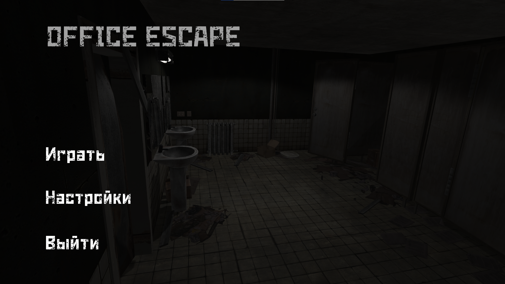
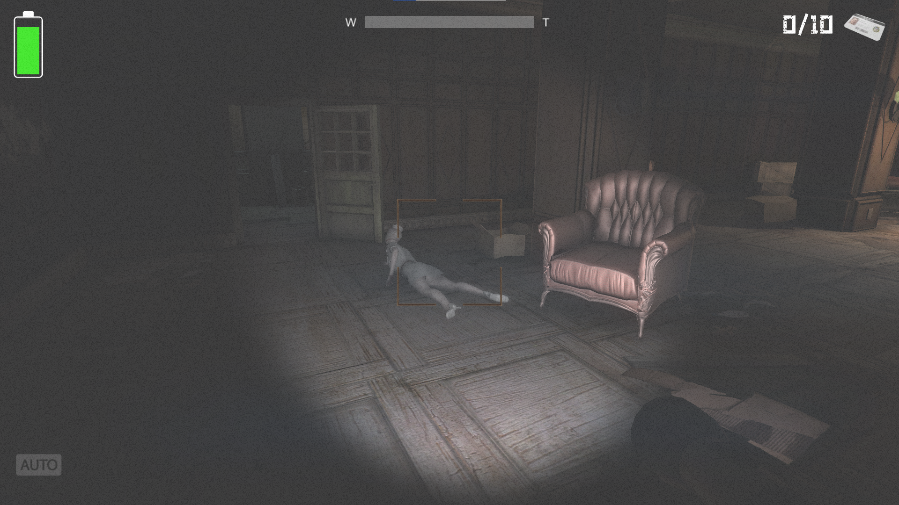
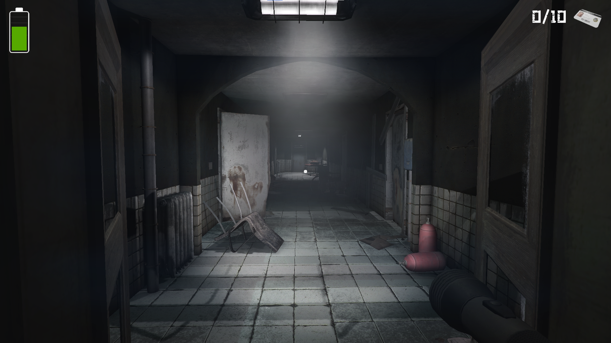

# 👻 Office Escape

> 3D хоррор-игра на Unity, созданная весной 2025.  
> Цель игрока — выбраться из заброшенного здания, решая головоломки и избегая опасностей.

---

## 🎮 Геймплей
- Игрок исследует тёмное помещение с ограниченной видимостью.
- Для прохождения игры нужно найти 10 ключ-карт, параллельно собирая батарейки для фонарика и избегая существ.
- За игроком охотится существо, и важно прятаться или убегать вовремя.

---

## ✨ Особенности
- 📹 **Существа видны только через камеру игрока** — в реальном окружении они невидимы.  
- 🔦 Атмосферное освещение и ограниченная видимость.  
- 🎧 Звуковое сопровождение и эффекты усиливает напряжение.  
- 👻 Неожиданные скримеры.  

---

## 🛠️ Технологии
- **Unity** (C#)
- Система освещения и тумана
- AI-логика врага
- Звуковое сопровождение для создания атмосферы

---

## 📸 Скриншоты

  <table>
    <tr>
      <td align="center">
         
        <b>Главное меню</b> 
        Настройка камеры и атмосфера
      </td>
      <td align="center">
         
        <b>Исследование этажа</b> 
        Темные помещения, головоломки
      </td>
      <td align="center">
         
        <b>Существо</b> 
        Видно только через камеру игрока
      </td>
    </tr>
    <tr>
      <td align="center">
         
        <b>Головоломка с ключами</b> 
        Найти ключи и открыть двери
      </td>
      <td></td>
    </tr>
  </table>

---

## 🚀 Запуск
1. Скачайте билд игры: [Horror Escape — Download](https://ссылка_на_билд)  
2. Запустите `.exe` файл (Windows) или `.app` (Mac).

---

## 🎥 Видео-геймплей

---

## 📌 О проекте
Игра была создана весной 2025 года как самостоятельный проект для практики в Unity и геймдизайне.  
Основной упор сделан на:
- Атмосферу напряжённости
- Простые, но интересные головоломки
- Динамику «исследование + побег»
